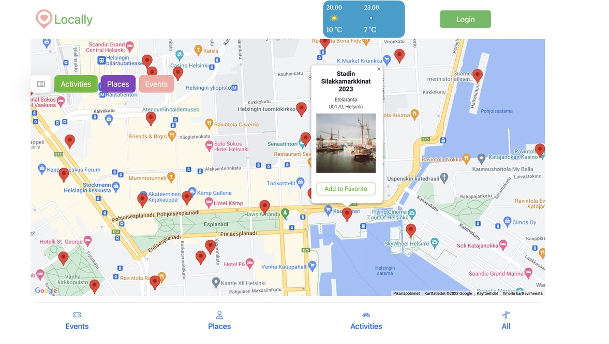
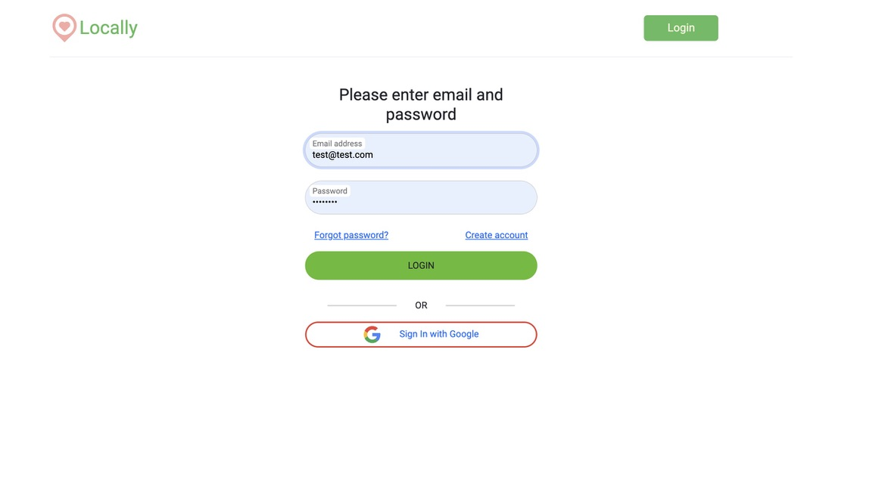
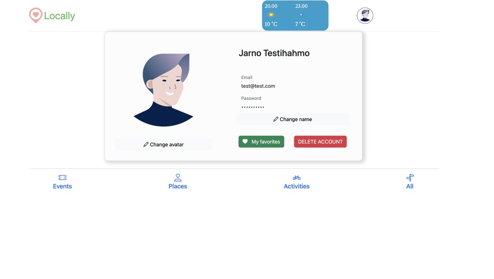
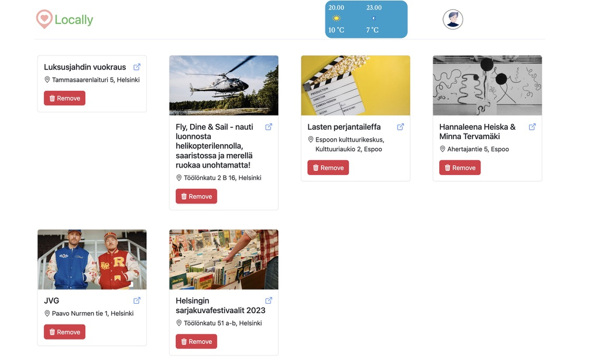
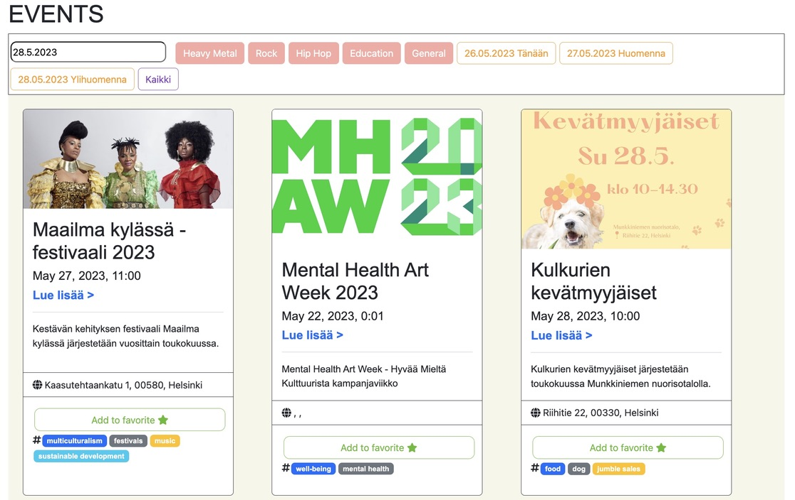
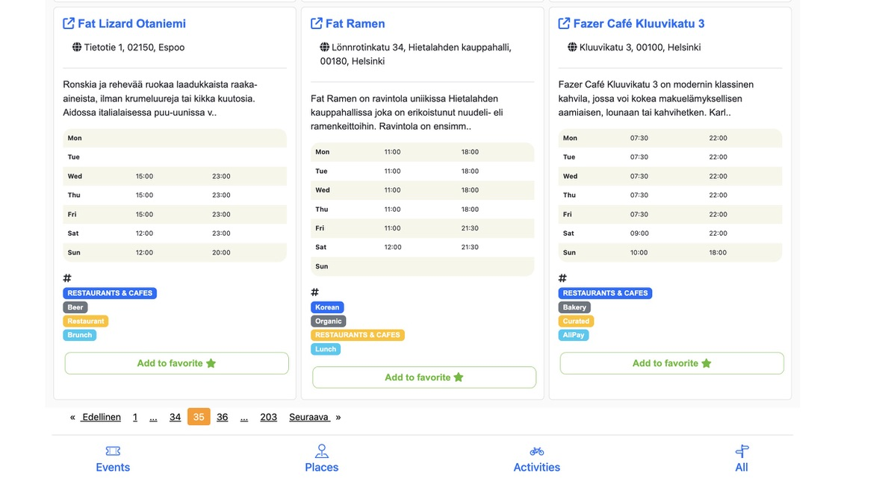
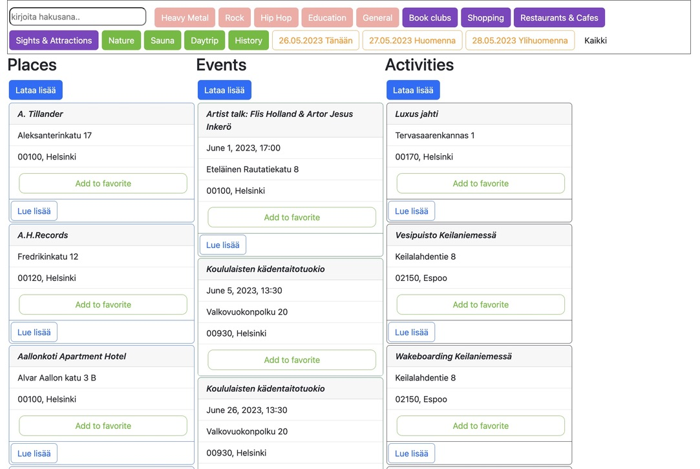

## Helsinki Open API 💎

👋
The up-to-date and standardized data, edited by our content experts, ensures consistency in communicating Helsinki’s services both in Finland and abroad. MyHelsinki Open API lets you flexibly filter the data for your needs, be it coordinates, opening hours, description texts or photos of different places, events or activities.

Find data in four languages, Finnish, English, Swedish and Chinese, and filter it based on categories or distance for example. The API is designed for flexible extraction of the specific sets of data that fit your needs including text attributes and a wide variety of photo material. Open data also enables local businesses in Helsinki to gain visibility in international sales and marketing channels.

Here is what we have made:

- Login/Register form 💻
- Add favorites items and remove 🌟
- Google Maps with places, events and activities of interest 🗺️
- Search and sort data, with words or dates ⚡️
- Weather forecast for the whole day 🌡️

## Links 🔵

[Open API Helsinki](https://open-api.myhelsinkifi/) ➜ 
[Weather API](https://www.weatherapi.com/) ➜

## Techniques 💻

- Angular 15
- CSS 3 and HTML
- Firebase
- Googlemaps
- NG2 SearchPipe
- NGX Pagination
- NG Gallery
- Angular Material
- Fontawesome
- Azure DevOps pipelines CI/CD

## Screenshots 📸
---

##### Map view when user enters to site. User can filter Activities, Places and Events and Google Map show pins on map.
----

##### Login form, user can create own account.
----

##### After register user can modify own user profile.
-----

##### All objects in site contains 'Add favorite' button, it collects items to user profile and save them to database in cloud.
-----

##### Screenshot of Events section, user can sort or search interesting events by date or search string.

-----

##### View of all Places, it contains also opening hours and link to external website.

-----

##### All data packed to one view and it contains all possible filters!
------